<h2>─────── ⚙️ &nbsp;T&nbsp;O&nbsp;O&nbsp;L&nbsp;S&nbsp; ⚙️ ───────</h2>

<b>L A N G U A G E S</b>
  

  
<b>F R A M E W O R K S &nbsp;&amp;&nbsp; B A C K E N D</b>
  

  
<b>A I &nbsp;/&nbsp; M L</b>
  

  
<b>D A T A B A S E S &nbsp;&amp;&nbsp; C L O U D</b>
  

  
<b>D E V &nbsp;T O O L S</b>
  

<!--
profile.svg: self-typing terminal card — ASCII portrait generated from photo,
line-print + typewriter CSS animations, blinking cursor. No external requests.
-->
