<picture>
  <source media="(prefers-color-scheme: dark)" srcset="dark_mode.svg">
  <source media="(prefers-color-scheme: light)" srcset="light_mode.svg">
  
</picture>

<!--
Self-updating profile card. `today.py` runs daily via GitHub Actions and
rewrites the stats (uptime, repos, stars, followers, commits, lines of code)
inside both SVGs using the GitHub GraphQL API.
Architecture inspired by Andrew6rant/Andrew6rant.
-->
